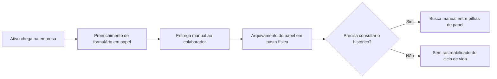
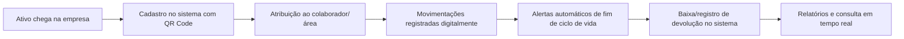

# Projeto 01 — Sistema de Gestão de Estoque de Ativos de TI

**Papel:** Product Owner, QA e Desenvolvedor
**Stack:** TypeScript, React, banco de dados relacional

---

## 1. Contexto

Empresa multinacional de grande porte, onde atuei como responsável pela área de suporte/TI, sem nenhum sistema de gestão de estoque de ativos. O controle de ativos físicos (notebooks, desktops, monitores) e não físicos (licenças de software) era feito inteiramente em papel: formulários preenchidos manualmente registrando o que foi entregue e para quem, arquivados sem padronização.

## 2. Problema

- Nenhum controle centralizado do inventário de ativos de TI.
- Impossível saber, em tempo real, quantos ativos existiam, onde estavam ou quem os utilizava.
- Risco de perda de ativos e de licenças de software vencidas/não rastreadas.
- Processo de baixa e movimentação dependente de papel, sujeito a extravio e retrabalho.
- Nenhuma visibilidade sobre o ciclo de vida dos equipamentos (previsão de troca/renovação).

## 3. Objetivo

Criar um sistema de gestão de estoque que centralizasse o cadastro, a movimentação e a baixa de ativos de TI (físicos e não físicos), trazendo visibilidade, rastreabilidade e controle do ciclo de vida de cada item.

## 4. Usuários

- Time de TI (administração do estoque no dia a dia)
- RH (entrada/saída de colaboradores e devolução de ativos)
- Gestores de área (visibilidade dos ativos sob sua equipe)

## 5. Personas

**Analista de TI (usuário primário)**
Responsável por cadastrar, movimentar e dar baixa em ativos. Precisa de agilidade no dia a dia e de rastreabilidade via QR Code para não depender de memória/planilha.

**Gestor de Área**
Precisa visualizar quais ativos estão sob sua equipe e solicitar novos equipamentos ou devoluções, sem depender de e-mails avulsos.

**Analista de RH**
Precisa confirmar rapidamente que um colaborador em desligamento devolveu todos os ativos sob seu nome.

## 6. Stakeholders

- Gerência de TI (patrocinadora do projeto)
- RH (processo de onboarding/offboarding)
- Gestores de área (usuários indiretos)

## 7. Fluxo AS IS

## 8. Fluxo TO BE

## 9. Requisitos Funcionais

| ID | Descrição |
|---|---|
| RF01 | O sistema deve permitir o cadastro de ativos físicos (notebook, desktop, monitor, etc.) |
| RF02 | O sistema deve permitir o cadastro de ativos não físicos (licenças de software) |
| RF03 | O sistema deve gerar um QR Code único por ativo cadastrado |
| RF04 | O sistema deve permitir o registro de movimentação de um ativo entre colaboradores/áreas |
| RF05 | O sistema deve permitir a baixa de um ativo (fim de vida, perda, devolução ao fornecedor) |
| RF06 | O sistema deve emitir alertas quando um ativo estiver próximo do fim do seu ciclo de vida |
| RF07 | O sistema deve permitir a consulta de um ativo via leitura do QR Code |
| RF08 | O sistema deve gerar relatórios de inventário por área/status/tipo de ativo |
| RF09 | O sistema deve manter histórico de todas as movimentações de um ativo |
| RF10 | O sistema deve permitir associar um ativo a um colaborador e a uma área |

## 10. Requisitos Não Funcionais

| ID | Descrição |
|---|---|
| RNF01 | O sistema deve responder às consultas em até 2 segundos |
| RNF02 | O sistema deve ser acessível via navegador, sem necessidade de instalação local |
| RNF03 | O histórico de movimentações não pode ser editável, apenas complementado (auditoria) |
| RNF04 | O acesso ao sistema deve ser restrito por perfil de usuário (TI, RH, Gestor) |

## 11. Critérios de Aceite (exemplo — cadastro de ativo)

- Dado que um analista de TI está na tela de cadastro
- Quando ele preenche os dados obrigatórios do ativo e salva
- Então o sistema deve gerar automaticamente um QR Code vinculado ao ativo
- E o ativo deve aparecer na listagem de inventário com status "Disponível"

## 12. Priorização (MoSCoW)

| Requisito | Prioridade |
|---|---|
| Cadastro de ativos (RF01, RF02) | Must have |
| Geração de QR Code (RF03) | Must have |
| Movimentação de ativos (RF04) | Must have |
| Baixa de ativos (RF05) | Must have |
| Alertas de ciclo de vida (RF06) | Should have |
| Consulta via QR Code (RF07) | Should have |
| Relatórios de inventário (RF08) | Should have |
| Histórico de movimentações (RF09) | Must have |
| Permissões por perfil (RNF04) | Could have (fase 2) |

## 13. MVP

Cadastro de ativos físicos e não físicos + geração de QR Code + movimentação + baixa + histórico básico. Relatórios avançados e alertas automáticos ficaram para a fase seguinte.

## 14. Roadmap

- **Fase 1 (MVP):** Cadastro, movimentação, baixa, QR Code, histórico
- **Fase 2:** Relatórios de inventário e dashboards
- **Fase 3:** Alertas automáticos de ciclo de vida
- **Fase 4:** Controle de permissões por perfil de acesso

## 15. Métricas

- **North Star:** % de ativos com localização/responsável rastreável em tempo real
- **KPIs:** tempo médio para localizar um ativo; nº de ativos sem rastro (antes vs. depois); tempo de processo de devolução no offboarding
- **OKR exemplo:** Objetivo — Eliminar o controle de ativos em papel. KR1: 100% dos ativos cadastrados no sistema. KR2: Reduzir para zero os registros em papel.

## 16. Lições Aprendidas

- Migrar de papel para planilha antes de desenvolver o sistema ajudou a validar o modelo de dados antes de codar.
- Levantamento de requisitos direto com quem usa no dia a dia (TI e RH) evitou retrabalho em funcionalidades que pareciam óbvias, mas não eram usadas.
- QR Code por ativo foi a funcionalidade que gerou maior adoção espontânea pelo time, por resolver um problema real de busca manual.
