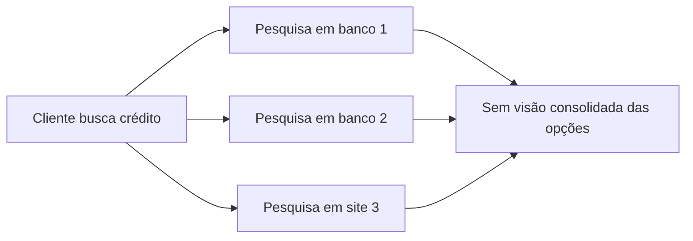
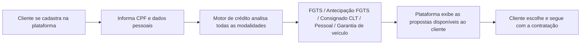

# Projeto 02 — Plataforma de Crédito

**Papel:** Product Owner e QA
**Stack:** Motor de decisão/análise de crédito integrado a múltiplas ofertas de produtos financeiros

---

## 1. Contexto

Plataforma voltada ao cliente final que centraliza a oferta de crédito. Ao se cadastrar, o usuário informa dados pessoais (CPF e demais dados) e um motor de crédito analisa automaticamente quais propostas ele tem disponíveis entre diferentes modalidades: crédito via FGTS, antecipação de FGTS, empréstimo consignado CLT, empréstimo pessoal e empréstimo com garantia de veículo.

## 2. Problema

O cliente que busca crédito normalmente precisa pesquisar em vários bancos e sites diferentes para descobrir quais ofertas tem disponíveis, sem visibilidade centralizada. Não existia um lugar único onde ele pudesse ver, de uma vez, todas as modalidades de crédito às quais tinha acesso.

## 3. Objetivo

Consolidar em uma única plataforma a análise e apresentação de todas as modalidades de crédito disponíveis para o cliente, a partir de seus dados pessoais, eliminando a necessidade de pesquisar em múltiplas fontes.

## 4. Usuários

Cliente final (pessoa física em busca de crédito).

## 5. Personas

**Cliente em busca de crédito**
Quer entender rapidamente quais opções de crédito tem disponíveis, sem burocracia e sem precisar visitar vários sites/bancos. Sensível a clareza de informação e confiança no tratamento dos seus dados pessoais.

## 6. Stakeholders

- Área de produto/negócio (definição de quais modalidades ofertar)
- Área jurídica/compliance (aderência à LGPD e regulação de crédito)
- Parceiros financeiros que fornecem as linhas de crédito

## 7. Fluxo AS IS

## 8. Fluxo TO BE

## 9. Requisitos Funcionais

| ID | Descrição |
|---|---|
| RF01 | O sistema deve permitir o cadastro do cliente com CPF e dados pessoais |
| RF02 | O sistema deve validar o CPF informado antes de prosseguir com a análise |
| RF03 | O motor de crédito deve consultar simultaneamente as modalidades: FGTS, antecipação de FGTS, consignado CLT, empréstimo pessoal e empréstimo com garantia de veículo |
| RF04 | O sistema deve exibir ao cliente todas as propostas disponíveis, com valor e condições |
| RF05 | O sistema deve permitir ao cliente selecionar uma proposta para dar sequência à contratação |
| RF06 | O sistema deve registrar consentimento do cliente para tratamento dos dados (LGPD) |

## 10. Requisitos Não Funcionais

| ID | Descrição |
|---|---|
| RNF01 | Dados pessoais e financeiros devem ser criptografados em trânsito e em repouso |
| RNF02 | O sistema deve estar em conformidade com a LGPD (finalidade, consentimento, minimização de dados) |
| RNF03 | O resultado da análise de crédito deve ser retornado em até poucos segundos |
| RNF04 | Logs de acesso a dados sensíveis devem ser auditáveis |

## 11. Critérios de Aceite (exemplo — análise de crédito)

- Dado que o cliente preencheu CPF e dados pessoais válidos
- Quando ele envia o formulário
- Então o motor de crédito deve consultar todas as modalidades disponíveis
- E a plataforma deve exibir somente as propostas para as quais o cliente é elegível

## 12. Priorização (MoSCoW)

| Requisito | Prioridade |
|---|---|
| Cadastro e validação de CPF (RF01, RF02) | Must have |
| Consulta ao motor de crédito multi-modalidade (RF03) | Must have |
| Exibição das propostas (RF04) | Must have |
| Consentimento LGPD (RF06) | Must have |
| Seleção e sequência de contratação (RF05) | Should have |

## 13. MVP

Cadastro do cliente, consulta ao motor de crédito para as modalidades principais (FGTS e consignado CLT) e exibição da proposta disponível, com consentimento LGPD.

## 14. Roadmap

- **Fase 1 (MVP):** FGTS e consignado CLT
- **Fase 2:** Antecipação de FGTS e empréstimo pessoal
- **Fase 3:** Empréstimo com garantia de veículo
- **Fase 4:** Otimização do motor de decisão e novos parceiros

## 15. Métricas

- **North Star:** % de clientes que recebem ao menos uma proposta de crédito elegível
- **KPIs:** taxa de conversão (cadastro → contratação), tempo médio de resposta do motor de crédito, taxa de propostas recusadas por inelegibilidade
- **OKR exemplo:** Objetivo — Ser o ponto único de consulta de crédito do cliente. KR1: aumentar em X% o número de modalidades ofertadas por cliente. KR2: reduzir o tempo de resposta do motor de crédito.

## 16. Lições Aprendidas

- Em produto de crédito, o trabalho de QA vai muito além do funcional: exige entendimento profundo de regras de negócio e da regulação (LGPD, normas de crédito), já que qualquer falha na análise afeta diretamente o cliente e a empresa.
- Centralizar múltiplas modalidades em um único motor de decisão exige testes de regressão robustos, pois uma mudança de regra em uma modalidade pode impactar outras.
