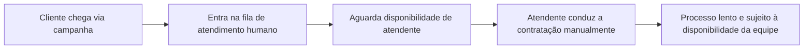
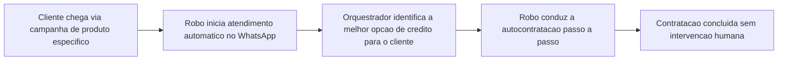

# Projeto 03 — WhatsApp Omnichannel (Robô de Autocontratação)

**Papel:** Product Owner e QA
**Stack:** Automação/omnichannel (integração via WhatsApp) + orquestração de fluxos (n8n)

---

## 1. Contexto

Robô de autocontratação para produtos de crédito, acionado quando o cliente chegava via campanha específica para um produto (ex.: consignado CLT). O robô conduzia todo o atendimento e a contratação do produto de forma automática, sem intervenção de um atendente humano, integrado a uma plataforma de automação/omnichannel e ao n8n para orquestração dos fluxos.

## 2. Problema

O atendimento tradicional (via atendente humano) gerava demora para o cliente ser atendido, especialmente em campanhas com grande volume de leads chegando para um produto específico. Não havia um caminho simples e imediato para o cliente concluir a contratação sozinho.

## 3. Objetivo

Automatizar de ponta a ponta o atendimento e a contratação de um produto de crédito específico via WhatsApp, eliminando o tempo de espera por um atendente humano.

## 4. Usuários

Cliente final que chega via campanha de um produto específico de crédito.

## 5. Personas

**Cliente de campanha**
Chegou até o WhatsApp por um anúncio/campanha de um produto específico (ex.: consignado CLT). Busca rapidez e simplicidade — não quer esperar em fila de atendimento humano para algo que pode ser resolvido de forma direta e guiada.

## 6. Stakeholders

- Área de marketing/growth (origem das campanhas)
- Área de produto (regras de elegibilidade e contratação)
- Parceiros de automação/omnichannel e orquestração (n8n)

## 7. Fluxo AS IS

## 8. Fluxo TO BE

## 9. Requisitos Funcionais

| ID | Descrição |
|---|---|
| RF01 | O robô deve iniciar o atendimento automaticamente quando o cliente chegar via campanha |
| RF02 | O robô deve conduzir a coleta de dados necessários para a contratação do produto |
| RF03 | O orquestrador deve identificar, entre as opções de crédito, a melhor para o cliente |
| RF04 | O robô deve concluir a autocontratação sem necessidade de atendente humano |
| RF05 | O sistema deve integrar-se à plataforma de automação/omnichannel para envio e recebimento de mensagens |
| RF06 | O sistema deve orquestrar o fluxo de atendimento via n8n |
| RF07 | O robô deve transferir para atendimento humano em casos de exceção/erro no fluxo |

## 10. Requisitos Não Funcionais

| ID | Descrição |
|---|---|
| RNF01 | O tempo de resposta do robô deve ser imediato (sem fila de espera) |
| RNF02 | O fluxo de conversa deve ser simples e didático para conclusão sem apoio humano |
| RNF03 | As integrações (omnichannel e n8n) devem ter monitoramento de falhas |

## 11. Critérios de Aceite (exemplo — autocontratação)

- Dado que o cliente chegou via campanha de um produto específico
- Quando ele inicia a conversa no WhatsApp
- Então o robô deve conduzir toda a coleta de dados e concluir a contratação sem transferir para um atendente, salvo em caso de exceção

## 12. Priorização (MoSCoW)

| Requisito | Prioridade |
|---|---|
| Início automático do atendimento (RF01) | Must have |
| Coleta de dados via robô (RF02) | Must have |
| Autocontratação sem atendente (RF04) | Must have |
| Integração omnichannel (RF05) | Must have |
| Orquestração via n8n (RF06) | Must have |
| Orquestrador de melhor opção (RF03) | Should have |
| Transferência para humano em exceções (RF07) | Should have |

## 13. MVP

Atendimento automático via WhatsApp para um único produto de campanha (consignado CLT), com coleta de dados e conclusão da contratação, e transferência para humano em caso de erro.

## 14. Roadmap

- **Fase 1 (MVP):** Autocontratação de um produto único via campanha
- **Fase 2:** Orquestrador de melhor oferta entre múltiplos produtos
- **Fase 3:** Expansão para novas campanhas e produtos
- **Fase 4:** Otimização do fluxo com base em taxa de abandono

## 15. Métricas

- **North Star:** % de contratações concluídas sem intervenção humana
- **KPIs:** tempo médio de atendimento (antes vs. depois), taxa de conclusão do fluxo, taxa de transferência para humano
- **OKR exemplo:** Objetivo — Eliminar o tempo de espera no atendimento de campanhas. KR1: reduzir o tempo médio de atendimento a zero fila. KR2: atingir X% de contratações 100% automatizadas.

## 16. Lições Aprendidas

- Fluxos de autoatendimento precisam de pontos claros de fallback para humano — nem toda exceção pode ser resolvida pelo robô.
- Integrar múltiplas ferramentas (omnichannel + orquestrador) exige testes de ponta a ponta constantes, pois falhas de integração impactam diretamente a conversão.
