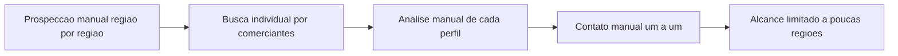
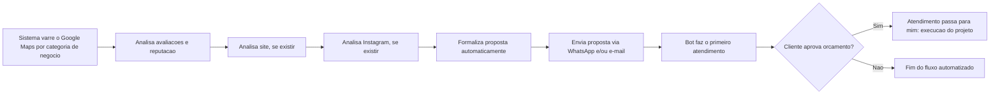

# Projeto 04 — Sales Agent IA

**Papel:** Discovery, PO, Backlog — condução completa do produto
**Stack:** Automação de prospecção com análise de dados públicos (Google Maps, site, Instagram) + bot de atendimento + envio via WhatsApp/e-mail

---

## 1. Contexto

Sistema de prospecção automatizada que varre o Google Maps em busca de comerciantes, farmácias, academias, escritórios de advocacia, clínicas de saúde e outros negócios locais. Para cada empresa encontrada, o sistema analisa o perfil (avaliações, quantidade de estrelas, feedbacks positivos/negativos), verifica se há site (e analisa sua estrutura e alinhamento com o negócio) e verifica presença no Instagram (identificando pontos de melhoria).

## 2. Problema

Prospecção manual de clientes limita o alcance geográfico e o volume de leads qualificados que é possível gerar. Não havia forma de identificar, em escala, quais negócios tinham maior potencial/necessidade de melhoria em presença digital (site, redes sociais) para oferecer serviços de forma direcionada.

## 3. Objetivo

Automatizar a prospecção, qualificação e o primeiro contato comercial com potenciais clientes, formalizando e enviando propostas automaticamente, ampliando o alcance geográfico sem depender de prospecção manual região por região.

## 4. Usuários

- Cliente final (comerciante/negócio prospectado)
- Eu mesmo, como operador do sistema e responsável pela entrega dos serviços (site, Instagram, marketing digital) após a aprovação da proposta

## 5. Personas

**Dono de pequeno/médio negócio local**
Tem um cadastro no Google Maps, mas pouca ou nenhuma otimização de presença digital (site desatualizado ou inexistente, Instagram sem estratégia). Não tem tempo nem conhecimento técnico para resolver isso sozinho, mas está aberto a uma proposta objetiva se ela chegar até ele.

## 6. Stakeholders

- Eu mesmo (product owner, operador e entregador do serviço)
- Ferramentas de automação/bot integradas ao fluxo (análise e primeiro atendimento)

## 7. Fluxo AS IS

## 8. Fluxo TO BE

## 9. Requisitos Funcionais

| ID | Descrição |
|---|---|
| RF01 | O sistema deve buscar negócios no Google Maps por categoria (comércio, farmácia, academia, escritório de advocacia, clínica, etc.) |
| RF02 | O sistema deve analisar avaliações e reputação (nota, feedbacks positivos e negativos) de cada negócio encontrado |
| RF03 | O sistema deve verificar se o negócio possui site e, em caso positivo, analisar sua estrutura e aderência ao tipo de negócio |
| RF04 | O sistema deve verificar se o negócio possui Instagram e identificar pontos de melhoria |
| RF05 | O sistema deve formalizar uma proposta automaticamente com base na análise realizada |
| RF06 | O sistema deve enviar a proposta via WhatsApp quando o número estiver disponível |
| RF07 | O sistema deve enviar a proposta via e-mail quando o endereço estiver disponível |
| RF08 | Um bot deve realizar o primeiro atendimento ao cliente que responder à proposta |
| RF09 | Ao cliente aprovar o orçamento, o atendimento deve ser transferido para atendimento humano (eu) |

## 10. Requisitos Não Funcionais

| ID | Descrição |
|---|---|
| RNF01 | A busca e análise de negócios deve ser executável em lote, sem limite de região |
| RNF02 | O envio de propostas deve respeitar boas práticas para não ser identificado como spam |
| RNF03 | O sistema deve registrar o status de cada lead (analisado, contatado, respondido, aprovado) |

## 11. Critérios de Aceite (exemplo — geração de proposta)

- Dado que um negócio foi encontrado e analisado (Google, site e Instagram)
- Quando a análise identifica pontos de melhoria
- Então o sistema deve formalizar uma proposta e enviá-la automaticamente via WhatsApp e/ou e-mail, conforme o contato disponível

## 12. Priorização (MoSCoW)

| Requisito | Prioridade |
|---|---|
| Busca por categoria no Google Maps (RF01) | Must have |
| Análise de reputação (RF02) | Must have |
| Formalização e envio de proposta (RF05, RF06, RF07) | Must have |
| Primeiro atendimento via bot (RF08) | Must have |
| Análise de site (RF03) | Should have |
| Análise de Instagram (RF04) | Should have |
| Transferência para atendimento humano (RF09) | Must have |

## 13. MVP

Busca de negócios por categoria + análise de reputação no Google + envio de proposta via WhatsApp + primeiro atendimento via bot.

## 14. Roadmap

- **Fase 1 (MVP):** Prospecção + análise de reputação + proposta via WhatsApp
- **Fase 2:** Análise de site
- **Fase 3:** Análise de Instagram
- **Fase 4:** Expansão para novas categorias de negócio e novas regiões/países

## 15. Métricas

- **North Star:** nº de leads qualificados e contatados por semana, sem limite geográfico
- **KPIs:** taxa de resposta às propostas, taxa de aprovação de orçamento, tempo entre prospecção e primeiro contato
- **OKR exemplo:** Objetivo — Escalar a prospecção além de uma única região. KR1: cobrir X categorias de negócio. KR2: aumentar em X% o volume de propostas enviadas por semana sem aumento de esforço manual.

## 16. Lições Aprendidas

- Automatizar a prospecção elimina a limitação geográfica do modelo manual — o mesmo sistema pode prospectar em qualquer região sem custo adicional de tempo.
- Definir critérios objetivos de qualificação (nota, presença de site, presença de Instagram) foi essencial para a proposta chegar personalizada e relevante, em vez de genérica.
