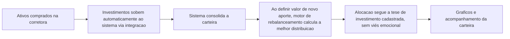

# Projeto 05 — Sistema de Investimentos

**Papel:** Product Owner, QA e Desenvolvedor
**Stack:** Consolidador de carteira com motor de rebalanceamento automático, integrado à corretora via plataforma de dados de investimento

---

## 1. Contexto

Consolidador de carteira de investimentos (ações, ETFs, criptomoedas) com uma camada de inteligência que faz o rebalanceamento automático da carteira com base em uma tese de investimento previamente definida e cadastrada no sistema.

## 2. Problema

Consolidadores de carteira de mercado costumam ser pagos e não eliminam a necessidade de decisão manual sobre qual ativo comprar em cada momento — decisão que tende a ser influenciada por viés emocional/notícias, em vez de seguir critérios objetivos de longo prazo.

## 3. Objetivo

Automatizar a decisão de alocação de novos aportes com base em uma tese de investimento pré-definida, eliminando o viés emocional e a necessidade de um consolidador pago de terceiros.

## 4. Usuários

Eu mesmo, como investidor e único usuário do sistema.

## 5. Personas

**Investidor de longo prazo**
Define previamente critérios objetivos de alocação (tese de investimento) e quer que, a cada novo aporte, o sistema decida automaticamente a melhor distribuição entre os ativos cadastrados — sem depender de análise manual ou de sentimento de mercado no momento da decisão.

## 6. Stakeholders

Eu mesmo (product owner, desenvolvedor e usuário final).

## 7. Fluxo AS IS

## 8. Fluxo TO BE

## 9. Requisitos Funcionais

| ID | Descrição |
|---|---|
| RF01 | O sistema deve permitir o cadastro dos ativos de interesse (ações, ETFs, criptomoedas) |
| RF02 | O sistema deve permitir o cadastro dos critérios da tese de investimento |
| RF03 | O sistema deve integrar-se automaticamente à corretora para importar investimentos realizados |
| RF04 | O sistema deve consolidar a carteira em tempo real a partir das posições importadas |
| RF05 | Ao informar um valor de aporte, o sistema deve calcular automaticamente a melhor distribuição entre os ativos, com base na tese cadastrada |
| RF06 | O sistema deve exibir gráficos de composição e evolução da carteira |

## 10. Requisitos Não Funcionais

| ID | Descrição |
|---|---|
| RNF01 | A integração com a corretora deve manter a carteira atualizada sem necessidade de input manual |
| RNF02 | O cálculo de rebalanceamento deve ser determinístico, seguindo exclusivamente os critérios cadastrados (sem intervenção subjetiva) |

## 11. Critérios de Aceite (exemplo — cálculo de aporte)

- Dado que a tese de investimento está cadastrada e a carteira atual está consolidada
- Quando informo um valor de novo aporte
- Então o sistema calcula e exibe a distribuição recomendada entre os ativos, de acordo com os critérios da tese

## 12. Priorização (MoSCoW)

| Requisito | Prioridade |
|---|---|
| Cadastro de ativos e tese (RF01, RF02) | Must have |
| Integração automática com a corretora (RF03) | Must have |
| Consolidação da carteira (RF04) | Must have |
| Cálculo automático de rebalanceamento (RF05) | Must have |
| Gráficos de acompanhamento (RF06) | Should have |

## 13. MVP

Cadastro de ativos e tese + integração com a corretora + cálculo de rebalanceamento automático para novos aportes.

## 14. Roadmap

- **Fase 1 (MVP):** Cadastro, integração e cálculo de rebalanceamento
- **Fase 2:** Gráficos e dashboard de acompanhamento
- **Fase 3:** Alertas de desvio da tese de investimento
- **Fase 4:** Suporte a múltiplas corretoras

## 15. Métricas

- **North Star:** aderência da carteira real à tese de investimento cadastrada
- **KPIs:** tempo economizado por aporte (decisão manual vs. automática), nº de decisões de compra tomadas sem intervenção manual
- **OKR exemplo:** Objetivo — Zerar decisões de investimento por impulso. KR1: 100% dos aportes alocados via motor automático. KR2: manter a carteira sempre dentro dos limites definidos pela tese.

## 16. Lições Aprendidas

- Ter critérios objetivos definidos antes de programar a lógica de alocação evitou que o sistema herdasse o mesmo viés emocional que ele deveria eliminar.
- Integrar diretamente com a corretora eliminou a etapa manual de atualização da carteira, que era o maior ponto de atrito nos consolidadores pagos usados anteriormente.
